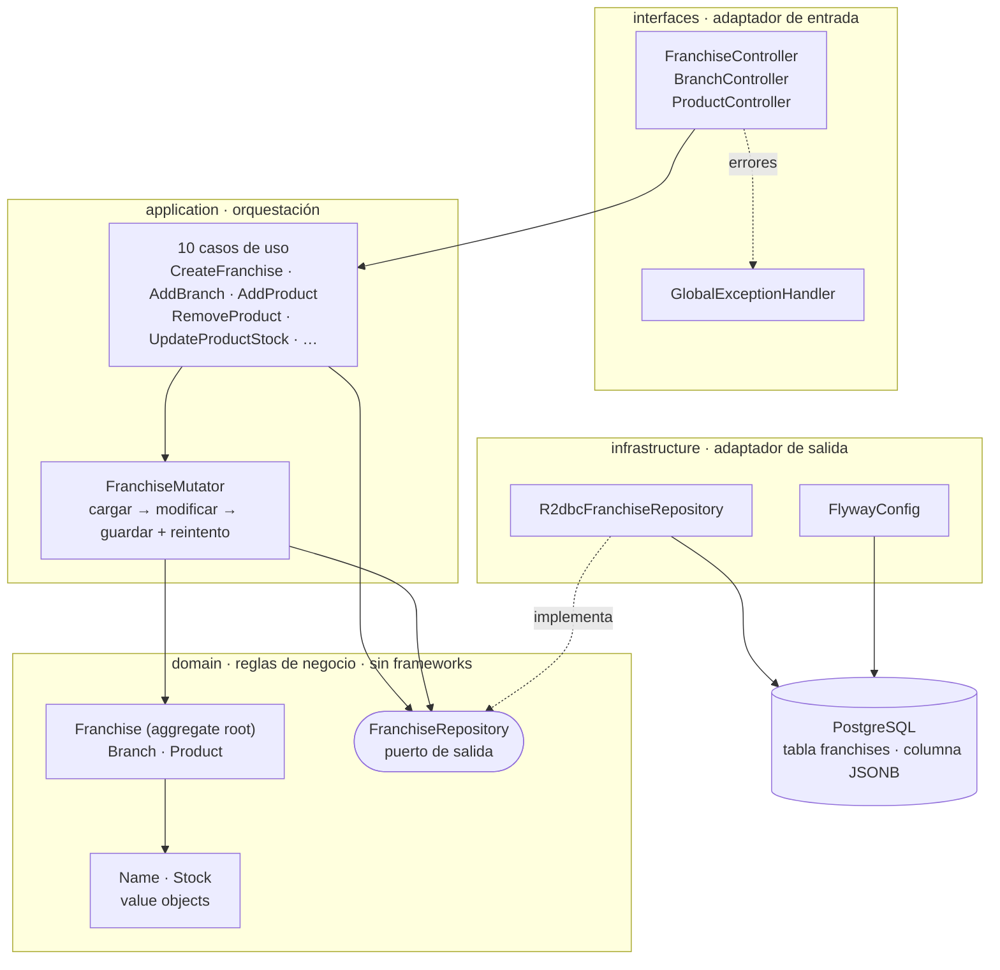

# Franchise Management API

API reactiva para la gestión de franquicias, sucursales y productos.

Construida con **Java 21**, **Spring Boot 3.5 (WebFlux)**, **PostgreSQL** vía **R2DBC** y arquitectura hexagonal con un modelo de dominio rico.

▶ **Probar el API en línea: https://franchise-management-api-430s.onrender.com** — Swagger UI, sin instalar nada.
*(La instancia gratuita se suspende por inactividad: la primera petición puede tardar ~50 s en despertar.)*

[](https://github.com/Xdewilo/franchise-management-api/actions/workflows/ci.yml)

---

## Tabla de contenido

- [Puesta en marcha en un comando](#puesta-en-marcha-en-un-comando)
- [Criterios de aceptación](#criterios-de-aceptación)
- [Puntos extra](#puntos-extra)
- [Endpoints](#endpoints)
- [Cómo probarlo](#cómo-probarlo)
- [Arquitectura](#arquitectura)
- [Modelo de datos](#modelo-de-datos)
- [Decisiones de arquitectura y trade-offs](#decisiones-de-arquitectura-y-trade-offs)
- [Concurrencia](#concurrencia)
- [Pruebas](#pruebas)
- [Infraestructura como código y despliegue](#infraestructura-como-código-y-despliegue)
- [Cómo evolucionaría](#cómo-evolucionaría)
- [Estructura del proyecto](#estructura-del-proyecto)

---

## Puesta en marcha en un comando

Sólo hace falta **Docker**. No se requiere Java, ni Gradle, ni credenciales de ningún proveedor de nube.

```bash
git clone https://github.com/Xdewilo/franchise-management-api.git
cd franchise-management-api
docker compose up --build
```

Al terminar el arranque:

| Recurso | URL |
|---|---|
| API | http://localhost:8080/api/v1/franchises |
| Swagger UI | http://localhost:8080/swagger-ui.html |
| OpenAPI (JSON) | http://localhost:8080/v3/api-docs |
| Health check | http://localhost:8080/actuator/health |

Para detenerlo: `docker compose down` (añade `-v` para borrar también los datos).

### Alternativa: ejecución local con Gradle

Requiere **JDK 21** y un PostgreSQL accesible.

```bash
# 1. Sólo la base de datos en Docker
docker compose up -d postgres

# 2. La aplicación en el equipo
./gradlew bootRun
```

La configuración se toma de variables de entorno, con valores por defecto pensados para el `docker compose` anterior. Copia `.env.example` a `.env` para ajustarlos:

| Variable | Por defecto | Descripción |
|---|---|---|
| `POSTGRES_HOST` | `localhost` | Host de PostgreSQL |
| `POSTGRES_PORT` | `5432` | Puerto |
| `POSTGRES_DB` | `franchises` | Base de datos |
| `POSTGRES_USER` | `franchise` | Usuario |
| `POSTGRES_PASSWORD` | `franchise` | Contraseña |
| `PORT` | `8080` | Puerto de escucha del API |

El esquema lo crea **Flyway** automáticamente durante el arranque: no hay que ejecutar ningún script a mano.

---

## Criterios de aceptación

| # | Requisito | Endpoint | Estado |
|---|---|---|---|
| 1 | Proyecto en Spring Boot | Spring Boot 3.5, Java 21 | ✅ |
| 2 | Agregar una nueva franquicia | `POST /api/v1/franchises` | ✅ |
| 3 | Agregar una sucursal a una franquicia | `POST /api/v1/franchises/{franchiseId}/branches` | ✅ |
| 4 | Agregar un producto a una sucursal | `POST /api/v1/franchises/{franchiseId}/branches/{branchId}/products` | ✅ |
| 5 | Eliminar un producto de una sucursal | `DELETE /api/v1/franchises/{franchiseId}/branches/{branchId}/products/{productId}` | ✅ |
| 6 | Modificar el stock de un producto | `PATCH /api/v1/franchises/{franchiseId}/branches/{branchId}/products/{productId}/stock` | ✅ |
| 7 | Producto con más stock por sucursal, indicando la sucursal | `GET /api/v1/franchises/{franchiseId}/branches/top-stock-products` | ✅ |
| 8 | Persistencia en un proveedor de nube | PostgreSQL en [Neon](https://neon.tech) | ✅ |

## Puntos extra

| Requisito | Cómo se resolvió | Estado |
|---|---|---|
| Empaquetado con Docker | Imagen multi-stage + `docker-compose.yml` | ✅ |
| Programación funcional / reactiva | WebFlux + R2DBC de extremo a extremo; agregado inmutable | ✅ |
| Actualizar el nombre de una franquicia | `PATCH /api/v1/franchises/{franchiseId}/name` | ✅ |
| Actualizar el nombre de una sucursal | `PATCH /api/v1/franchises/{franchiseId}/branches/{branchId}/name` | ✅ |
| Actualizar el nombre de un producto | `PATCH .../products/{productId}/name` | ✅ |
| Persistencia aprovisionada con IaC | Terraform sobre Neon — ver [`infra/`](infra/) | ✅ |
| Solución desplegada en la nube | Contenedor en Render, con blueprint declarativo — [probar](https://franchise-management-api-430s.onrender.com) | ✅ |

Adicionalmente, sin que el enunciado lo pidiera: bloqueo optimista para escrituras concurrentes, listado paginado, documentación OpenAPI, respuestas de error normalizadas e integración continua.

---

## Endpoints

Prefijo común: `/api/v1/franchises`

| Método | Ruta | Descripción |
|---|---|---|
| `POST` | `/` | Registra una franquicia |
| `GET` | `/` | Lista franquicias (paginado: `?page=0&size=20`) |
| `GET` | `/{franchiseId}` | Consulta una franquicia con su árbol completo |
| `PATCH` | `/{franchiseId}/name` | Renombra la franquicia |
| `POST` | `/{franchiseId}/branches` | Abre una sucursal |
| `PATCH` | `/{franchiseId}/branches/{branchId}/name` | Renombra la sucursal |
| `POST` | `/{franchiseId}/branches/{branchId}/products` | Agrega un producto |
| `DELETE` | `/{franchiseId}/branches/{branchId}/products/{productId}` | Elimina el producto |
| `PATCH` | `/{franchiseId}/branches/{branchId}/products/{productId}/stock` | Modifica el stock |
| `PATCH` | `/{franchiseId}/branches/{branchId}/products/{productId}/name` | Renombra el producto |
| `GET` | `/{franchiseId}/branches/top-stock-products` | Producto con más stock por sucursal |

Las rutas de sucursales y productos cuelgan de su franquicia porque **no existen fuera de ella**: la URL refleja la estructura real del modelo. Por el mismo motivo, todas las escrituras devuelven la franquicia completa ya actualizada, de modo que el cliente confirma el estado sin una consulta adicional.

### Códigos de estado

| Código | Cuándo |
|---|---|
| `200` | Consulta o modificación correcta |
| `201` | Franquicia, sucursal o producto creados |
| `400` | Cuerpo inválido, stock negativo o identificador mal formado |
| `404` | La franquicia, la sucursal o el producto no existen |
| `409` | Nombre duplicado, o conflicto por modificación concurrente |
| `500` | Error inesperado (se registra la traza; al cliente no se le exponen detalles internos) |

Todos los errores comparten la misma forma:

```json
{
  "status": 409,
  "code": "DUPLICATE_BRANCH_NAME",
  "message": "La franquicia ya tiene una sucursal llamada 'Sucursal Norte'",
  "path": "/api/v1/franchises/1578dbf6-a7a6-4ca5-bc51-3a6c7dd2eedd/branches",
  "timestamp": "2026-08-26T03:14:22.481Z"
}
```

El campo `code` es estable y legible por máquina, para que un cliente pueda reaccionar sin analizar textos. En los errores de validación se añade `details` con **todos** los campos rechazados de una vez.

---

## Cómo probarlo

### Opción 1 — Swagger UI

http://localhost:8080/swagger-ui.html — todos los endpoints documentados y ejecutables desde el navegador.

### Opción 2 — Colección de peticiones

[`http/franchise-api.http`](http/franchise-api.http) contiene las 20 peticiones en orden, encadenando los identificadores de una a otra. Se ejecuta desde IntelliJ IDEA o desde VS Code con la extensión *REST Client*.

### Opción 3 — Recorrido completo con `curl`

```bash
API=http://localhost:8080/api/v1/franchises

# 1. Crear la franquicia
FRANCHISE=$(curl -s -X POST $API \
  -H 'Content-Type: application/json' \
  -d '{"name":"Vive Fresh"}')
FID=$(echo $FRANCHISE | jq -r .id)

# 2. Abrir dos sucursales
curl -s -X POST $API/$FID/branches -H 'Content-Type: application/json' \
  -d '{"name":"Sucursal Norte"}' > /dev/null
BRANCHES=$(curl -s -X POST $API/$FID/branches -H 'Content-Type: application/json' \
  -d '{"name":"Sucursal Sur"}')
NORTH=$(echo $BRANCHES | jq -r '.branches[0].id')
SOUTH=$(echo $BRANCHES | jq -r '.branches[1].id')

# 3. Agregar productos
curl -s -X POST $API/$FID/branches/$NORTH/products -H 'Content-Type: application/json' \
  -d '{"name":"Arepa de huevo","stock":25}' > /dev/null
curl -s -X POST $API/$FID/branches/$NORTH/products -H 'Content-Type: application/json' \
  -d '{"name":"Jugo de mango","stock":80}' > /dev/null
curl -s -X POST $API/$FID/branches/$SOUTH/products -H 'Content-Type: application/json' \
  -d '{"name":"Café","stock":10}' > /dev/null

# 4. Criterio 7 — producto con más stock por sucursal
curl -s $API/$FID/branches/top-stock-products | jq
```

Resultado:

```json
[
  {
    "branchId": "127899ed-5f77-4dd4-968a-1039e498411d",
    "branchName": "Sucursal Norte",
    "productId": "d6edd420-e794-4f95-951c-b6649d491696",
    "productName": "Jugo de mango",
    "stock": 80
  },
  {
    "branchId": "9be787ee-5ce9-44f3-bff2-a40b2697b288",
    "branchName": "Sucursal Sur",
    "productId": "42abb1d0-15ac-47f0-9f77-30653f26d5fe",
    "productName": "Café",
    "stock": 10
  }
]
```

---

## Arquitectura

Arquitectura hexagonal (puertos y adaptadores) con cuatro capas y la dependencia siempre apuntando hacia el dominio:



### Qué hay en cada capa

| Capa | Responsabilidad | Conoce a |
|---|---|---|
| `domain` | Reglas de negocio e invariantes. **Java puro**: ni Spring, ni R2DBC, ni HTTP | nada |
| `application` | Orquesta los casos de uso sobre el agregado | `domain` |
| `infrastructure` | Implementa los puertos: PostgreSQL, migraciones, OpenAPI | `domain` |
| `interfaces` | Traduce HTTP a casos de uso y de vuelta | `application` |

La consecuencia práctica: **el dominio y los casos de uso se prueban sin base de datos y sin contexto de Spring**, con un doble en memoria del puerto que cabe en 80 líneas. Esa suite corre en milisegundos.

### El modelo de dominio es rico, no anémico

Las reglas viven **dentro** del agregado, no en una capa de servicios:

```java
// Franchise.java — el agregado protege sus propias invariantes
public Franchise addBranch(Name branchName) {
    if (hasBranchNamed(branchName, null)) {
        throw ConflictException.duplicateBranchName(branchName.value());
    }
    return withBranches(append(branches, Branch.create(branchName)));
}
```

Es imposible construir un estado inválido: no hay setters, no hay constructores públicos que salten la validación, y `Name` y `Stock` rechazan en su propio constructor cualquier valor que no cumpla la invariante.

El agregado además es **inmutable**: cada operación devuelve una instancia nueva. Encaja con el enfoque funcional que pedía el enunciado y evita estado compartido en un stack reactivo, donde la ejecución cambia de hilo.

---

## Modelo de datos

Una sola tabla. El árbol completo de sucursales y productos vive en una columna **JSONB**:

```sql
CREATE TABLE franchises (
    id          UUID        PRIMARY KEY,
    name        TEXT        NOT NULL,
    branches    JSONB       NOT NULL DEFAULT '[]'::jsonb,
    version     BIGINT      NOT NULL DEFAULT 0,
    created_at  TIMESTAMPTZ NOT NULL DEFAULT now(),
    updated_at  TIMESTAMPTZ NOT NULL DEFAULT now()
);

CREATE UNIQUE INDEX ux_franchises_name_lower  ON franchises (lower(name));
CREATE INDEX ix_franchises_branches_gin       ON franchises USING GIN (branches jsonb_path_ops);
```

**Por qué así.** `Franquicia` es el aggregate root y la frontera de consistencia del modelo: sucursales y productos no tienen ciclo de vida propio, y todas las reglas de unicidad se evalúan sobre el árbol completo. Al hacer coincidir la frontera del agregado con la frontera transaccional:

- Agregar un producto, borrarlo o ajustar su stock es **una sola escritura atómica**. No hacen falta transacciones que abarquen varias tablas, ni existe la posibilidad de un estado a medias.
- Leer la franquicia es **una sola fila**, sin JOINs de reconstrucción ni el problema N+1.
- El índice único sobre `lower(name)` traslada al motor la unicidad global del nombre, que es donde puede garantizarse de verdad ante peticiones simultáneas.
- El índice GIN habilita búsquedas por contenido dentro del árbol (`@>`) sin recorrer toda la tabla.

### El criterio 7, resuelto en el motor

El producto con más stock de cada sucursal **no** se calcula recorriendo el agregado en memoria, sino con una consulta:

```sql
SELECT DISTINCT ON (branch.value ->> 'id')
       (branch.value  ->> 'id')::uuid       AS branch_id,
        branch.value  ->> 'name'            AS branch_name,
       (product.value ->> 'id')::uuid       AS product_id,
        product.value ->> 'name'            AS product_name,
       (product.value ->> 'stock')::bigint  AS stock
  FROM franchises f
  CROSS JOIN LATERAL jsonb_array_elements(f.branches)               AS branch(value)
  CROSS JOIN LATERAL jsonb_array_elements(branch.value->'products') AS product(value)
 WHERE f.id = :franchiseId
 ORDER BY branch.value ->> 'id',
          (product.value ->> 'stock')::bigint DESC,
          product.value ->> 'name' ASC;
```

Los dos `LATERAL` despliegan el árbol JSONB en filas —una por producto— y `DISTINCT ON` se queda con la primera de cada sucursal según ese orden, que es la de mayor stock. El desempate por nombre hace la respuesta **determinista** cuando dos productos empatan en existencias.

Con datos de prueba, recorrer el agregado en Java daría el mismo resultado. La diferencia aparece con un catálogo grande: esa alternativa obliga a mover el árbol entero a la JVM para devolver una fila por sucursal.

> Las sucursales sin productos no aparecen en el resultado: no tienen ningún producto que sea «el de mayor stock».

---

## Decisiones de arquitectura y trade-offs

### JSONB embebido en lugar de tres tablas normalizadas

**A favor:** atomicidad natural en la frontera del agregado, lecturas sin JOINs, y un modelo de datos que refleja exactamente el modelo de dominio.

**En contra:** una franquicia con decenas de miles de productos produciría un documento grande, y PostgreSQL limita cada valor a 1 GB (en la práctica, TOAST comprime y trocea mucho antes). Además, cada escritura reescribe la fila completa.

**Por qué se aceptó:** el enunciado describe franquicias con sucursales y catálogos de tamaño de negocio real —decenas o cientos de productos por sucursal—, muy lejos de ese límite. Si el volumen creciera, la ruta de salida está descrita en [Cómo evolucionaría](#cómo-evolucionaría) y no obliga a rehacer el dominio.

### Sin patrón Mediator

Se evaluó introducir un Mediator (estilo CQRS) para desacoplar los controladores de los casos de uso. **Se descartó**: con un único agregado y diez operaciones, resolver el handler por reflexión en tiempo de ejecución sacrificaría la verificación en tiempo de compilación sin reducir acoplamiento real, y añadiría una indirección que hay que leer antes de llegar a la lógica de negocio.

Un Mediator paga cuando hay muchos handlers, varios puntos de entrada (REST y consumidores de mensajería, por ejemplo) y un pipeline transversal —validación, trazas, transacciones— que conviene centralizar. Ninguna de esas condiciones se da aquí.

Por el mismo motivo se prescindió de interfaces de puerto de entrada: los casos de uso ya son la abstracción, y envolverlos en una interfaz por clase duplicaría el número de ficheros sin desacoplar nada.

### `DatabaseClient` con SQL explícito, en lugar de un repositorio derivado

La identidad del agregado se genera en la aplicación, no en la base de datos. Con un `ReactiveCrudRepository`, una entidad con el id ya asignado se interpreta como existente y se intenta actualizar en vez de insertar, lo que obliga a rodear la heurística de Spring Data. Escribiendo el SQL, la inserción y el `UPDATE` condicionado por versión quedan a la vista y bajo control, y el criterio 7 se expresa tal cual se ejecuta.

### R2DBC, y por qué no JPA

El enunciado valoraba programación reactiva. JPA es bloqueante por diseño: usarlo bajo WebFlux retiene un hilo del *event loop* en cada consulta y anula la ventaja del modelo. R2DBC es no bloqueante de extremo a extremo. El coste es que R2DBC no ofrece relaciones, *lazy loading* ni *dirty checking* — coste que aquí resulta irrelevante, porque el agregado se guarda como un único documento.

### Flyway sin pool JDBC residente

Flyway sólo habla JDBC. La salida habitual —añadir el starter de JDBC— dejaría un pool de conexiones abierto durante toda la vida del proceso para no usarse jamás después del arranque. En su lugar, [`FlywayConfig`](src/main/java/com/jeremyposada/franchise/infrastructure/config/FlywayConfig.java) construye su propia conexión, migra y la cierra. La URL JDBC se **deriva** de `spring.r2dbc.url`, para que no exista una segunda copia de los datos de conexión que pueda quedar desincronizada.

### Validación en dos sitios (y por qué no es duplicación)

Los DTOs declaran Bean Validation y el dominio valida en sus constructores. No es lo mismo:

- La del **borde** existe para dar un `400` con la lista completa de campos rechazados, que es lo que necesita quien consume el API.
- La del **dominio** es la garantía real: se cumple venga la petición de donde venga —REST hoy, un consumidor de mensajería mañana, un test— y es la que hace imposible construir un objeto inválido.

Si sólo existiera la primera, la invariante dependería del adaptador de turno.

---

## Concurrencia

Como el agregado se guarda completo, dos peticiones simultáneas sobre la misma franquicia harían un ciclo leer–modificar–escribir y **la última pisaría los cambios de la primera** — un producto agregado desaparecería sin ningún error visible.

La columna `version` lo impide. Cada actualización lleva la versión esperada en el `WHERE`:

```sql
UPDATE franchises
   SET name = :name, branches = CAST(:branches AS jsonb),
       version = version + 1, updated_at = now()
 WHERE id = :id
   AND version = :expectedVersion
```

Si otra petición ya escribió, ninguna fila coincide y la operación se reporta como conflicto en lugar de sobrescribir en silencio.

Ante ese conflicto, [`FranchiseMutator`](src/main/java/com/jeremyposada/franchise/application/usecase/FranchiseMutator.java) **reintenta el ciclo completo** —releyendo el estado ya actualizado— con espera exponencial. Sólo si el choque persiste tras varios intentos se devuelve `409` al cliente. En la práctica, dos peticiones que agregan productos distintos a la misma franquicia acaban ambas aplicándose.

Está verificado en las dos direcciones: el test de integración comprueba que una escritura obsoleta se rechaza contra PostgreSQL real, y el test de aplicación comprueba que el reintento se produce y que se agota correctamente.

---

## Pruebas

```bash
./gradlew test                              # Suite completa (necesita Docker)
./gradlew test -PskipIntegrationTests       # Sólo dominio y aplicación, sin Docker
./gradlew build                             # Compilación + pruebas + jar
```

Informe HTML en `build/reports/tests/test/index.html`; cobertura JaCoCo en `build/reports/jacoco/test/html/index.html`.

**74 pruebas** repartidas en tres niveles:

| Nivel | Qué verifica | Infraestructura |
|---|---|---|
| **Dominio** | Invariantes del agregado y de los value objects: duplicados, stock negativo, inmutabilidad | Ninguna |
| **Aplicación** | Orquestación de los casos de uso, propagación de errores, reintento ante conflicto | Doble en memoria del puerto |
| **Integración** | El adaptador R2DBC y el API completo: JSONB, `LATERAL`, bloqueo optimista, índice único, códigos HTTP | PostgreSQL 16 en Testcontainers |

Los tests de integración usan **PostgreSQL real, no una base embebida**. El adaptador se apoya en JSONB, `LATERAL` y `DISTINCT ON`, que ningún sustituto reproduce: probar contra otro motor daría una confianza que no se corresponde con lo que corre en producción.

---

## Infraestructura como código y despliegue

### Base de datos aprovisionada con Terraform

El directorio [`infra/`](infra/) contiene la definición Terraform del proyecto, la rama y la base de datos en **Neon** (PostgreSQL gestionado):

```bash
cd infra
cp terraform.tfvars.example terraform.tfvars   # añade tu API key de Neon
terraform init
terraform plan
terraform apply
```

`terraform.tfvars` está en `.gitignore`: **ninguna credencial se versiona**. La cadena de conexión se marca como `sensitive`, de modo que Terraform no la imprime en los logs.

### Aplicación desplegada en Render

El servicio está descrito como código en [`render.yaml`](render.yaml), de modo que el despliegue no depende de recordar qué se marcó en una consola web. Se crea desde **Render → New → Blueprint**, apuntando a este repositorio.

Corre en la región **Ohio**, la misma del proyecto de Neon: colocalizar cómputo y base evita que cada consulta cruce medio continente.

La conexión se inyecta como **variables de entorno**, nunca desde el repositorio ni desde la imagen:

| Variable | Origen |
|---|---|
| `SPRING_R2DBC_URL` | `terraform output -raw r2dbc_url` |
| `SPRING_R2DBC_USERNAME` | `terraform output -raw username` |
| `SPRING_R2DBC_PASSWORD` | `terraform output -raw password` |

Son las propiedades estándar de Spring Boot, así que sobrescriben la configuración por defecto de `application.yml` sin necesidad de un perfil aparte. Flyway deriva de ellas su propia URL JDBC y migra el esquema durante el arranque.

| | |
|---|---|
| **Swagger UI** | **https://franchise-management-api-430s.onrender.com** |
| **API** | https://franchise-management-api-430s.onrender.com/api/v1/franchises |
| **OpenAPI (JSON)** | https://franchise-management-api-430s.onrender.com/v3/api-docs |
| **Health check** | https://franchise-management-api-430s.onrender.com/actuator/health |

La raíz del servicio redirige a Swagger UI, así que se puede probar el API completo desde el navegador sin instalar nada.

> **Nota sobre el nivel gratuito:** tanto Render como Neon suspenden los recursos inactivos. **La primera petición tras un rato sin uso puede tardar ~50 segundos** mientras el contenedor y la base despiertan; las siguientes responden con normalidad. No es un fallo del servicio.

### Integración continua

[`.github/workflows/ci.yml`](.github/workflows/ci.yml) compila, ejecuta **toda** la suite —incluidos los tests con Testcontainers, porque el runner de GitHub trae Docker— y construye la imagen, en cada push y en cada pull request. No existe una suite reducida «de CI» que pruebe menos que la del portátil.

---

## Cómo evolucionaría

Decisiones que hoy no se justifican, y el momento concreto en que sí lo harían:

| Si aparece… | La respuesta sería |
|---|---|
| Franquicias con decenas de miles de productos | Sacar los productos a su propia tabla referenciada por sucursal. El dominio no cambia: sólo se reescribe el adaptador, porque el puerto ya aísla a la aplicación del esquema |
| Muchas más lecturas que escrituras | Proyección de lectura mantenida aparte (CQRS con modelos separados), alimentada por eventos de dominio. El agregado ya es la única fuente de escritura, que es la precondición |
| Necesidad de auditoría o integración con otros servicios | Publicar eventos de dominio (`ProductStockChanged`, `BranchOpened`) desde el agregado hacia un *outbox* transaccional, y de ahí a mensajería |
| Contención alta sobre una misma franquicia | Reducir la granularidad del agregado o mover el stock a operaciones incrementales (`UPDATE ... SET stock = stock + n`), que no requieren leer antes de escribir |
| Varios clientes o multi-tenencia | Spring Security con JWT en el borde y aislamiento por esquema o por Row-Level Security en PostgreSQL |

En todos los casos, lo que hace viable el cambio es que **el dominio no conoce a la infraestructura**: la evolución se concentra en los adaptadores.

---

## Estructura del proyecto

```
franchise-management-api
├── src/main/java/com/jeremyposada/franchise
│   ├── domain                        # Java puro, sin frameworks
│   │   ├── model                     # Franchise (aggregate root), Branch, Product, Name, Stock
│   │   ├── exception                 # Errores de negocio con su DomainErrorCode
│   │   └── port                      # FranchiseRepository — puerto de salida
│   ├── application
│   │   ├── usecase                   # Un caso de uso por operación + FranchiseMutator
│   │   └── PagedResult.java
│   ├── infrastructure
│   │   ├── persistence               # Adaptador R2DBC y mapeo del documento JSONB
│   │   └── config                    # Flyway y OpenAPI
│   └── interfaces/rest               # Controladores, DTOs y manejo de errores
├── src/main/resources
│   ├── db/migration                  # Migraciones Flyway
│   └── application.yml
├── src/test/java                     # Dominio · aplicación · integración
├── infra                             # Terraform (Neon)
├── http                              # Colección de peticiones lista para ejecutar
├── docker-compose.yml
└── Dockerfile
```

---

## Licencia

MIT — ver [LICENSE](LICENSE).

**Autor:** Jeremy Posada · [GitHub](https://github.com/Xdewilo) · [LinkedIn](https://www.linkedin.com/in/jeremy-posada-56855820b)
